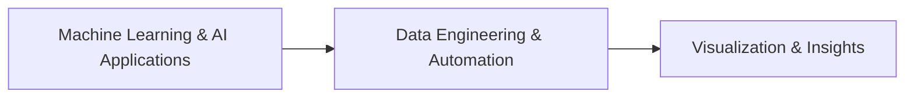
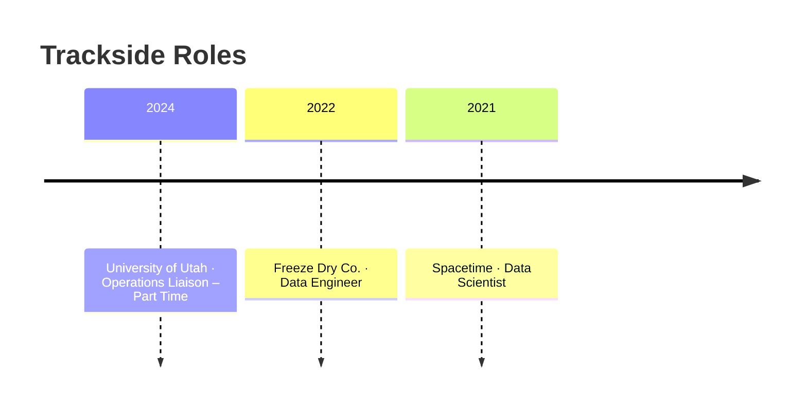

<p align="center">
  
</p>
<p align="center">
  
  
  
</p>

<div align="center">

```
🏁🏁🏁🏁🏁🏁🏁🏁🏁🏁🏁🏁🏁🏁🏁🏁🏁🏁🏁🏁
         PIT LANE ENTRY
🏁🏁🏁🏁🏁🏁🏁🏁🏁🏁🏁🏁🏁🏁🏁🏁🏁🏁🏁🏁
```

</div>

## 👋 Hi, I’m Abhinav Dumpala

I’m a Data Scientist and M.S. Data Science student at the University of Utah, passionate about using data and machine learning to solve real-world problems.

My work bridges data engineering, predictive modeling, and automation, with experience building intelligent systems that improve efficiency and decision-making.

---

### 🔬 Current Focus — Race Strategy Console



- Machine Learning & AI Applications – Designing interpretable models for prediction, classification, and recommendation.
- Data Engineering & Automation – Building ETL pipelines and Power Automate workflows for real-time analytics.
- Visualization & Insights – Turning complex datasets into actionable dashboards with Tableau, Power BI, and Python.

---

### 💼 Experience — Pit Wall Timeline



#### University of Utah (Mar 2024 – Aug 2025) — Operations Liaison – Part Time
- Coordinated operations for 160+ volunteers using Agile workflows.
- Streamlined concession operations through iterative improvement and cross-team collaboration.

#### Freeze Dry Co. (May 2022 – Jan 2023) — Data Engineer
- Automated ETL pipelines in Python, SQL, and Spark, cutting reporting lag by 20%.
- Built ML anomaly detection models reducing QA false positives by 25%.
- Created Power BI/Tableau dashboards that sped up executive decisions by 30%.
- Optimized MySQL and Oracle databases for 40% faster query performance.

#### Spacetime (Apr 2021 – Mar 2022) — Data Scientist
- Modeled 100K+ customer records to improve campaign ROI by 10%.
- Built Random Forest and Neural Net models increasing forecast accuracy by 15%.
- Deployed NLP pipeline achieving 90% precision on sentiment classification.
- Collaborated with product and marketing teams to operationalize insights.

---

### 🧠 Projects — Telemetry Board

| Project | Description | Tech Stack |
| --- | --- | --- |
| 🏎️ AI Course Recommendation Tool | GPT-based system mapping courses to job roles via SharePoint integration, reducing manual advising time by 60%. | Power Automate, GPT API, SharePoint |
| 🏁 AI Therapist Chatbot | Sentiment-aware chatbot recommending media content, 85% accuracy in emotion detection. | NLP, Flask, MySQL |
| 🏆 Stock Price Prediction | LSTM & regression ensemble forecasting with 12% improvement in accuracy. | TensorFlow, scikit-learn, Python |
| 🚦 Uber Data Analytics | Analyzed 1M+ rideshare records to find demand clusters and pricing inefficiencies. | R, ggplot2, tidyverse |

---

### 🧩 Skills — Garage Inventory

| Category | Toolbox |
| --- | --- |
| 🛠️ Languages | Python, SQL, R, Bash, Spark, Git |
| 🤖 Machine Learning | scikit-learn, TensorFlow, PyTorch, XGBoost, NLP, Deep Learning |
| 📊 Visualization | Tableau, Power BI, Seaborn, Matplotlib, Plotly |
| 🗄️ Data Systems | MySQL, Oracle, ETL Pipelines, SharePoint Integration |
| 🧪 Concepts | Predictive Modeling, Feature Engineering, A/B Testing, Time-Series Forecasting |
| 🏅 Certifications | Six Sigma Green Belt (2024), Data Science 4 All – NIT Patna, Microsoft Data Analyst (In Progress) |

---

### 🎓 Education — Podium Finish

| Position | Program |
| --- | --- |
| 🥇 | University of Utah – M.S. in Computational and Data Science (Aug 2023 – Aug 2025) |
| 🥈 | Vardhaman College of Engineering (India) – B.Tech in Information Technology (2018 – 2022) |

---

### 🌱 What Drives Me — Driver’s Briefing

> I love connecting technical precision with strategic thinking—whether it’s optimizing manufacturing pipelines, designing AI recommendation systems, or visualizing insights that guide business moves.

---

### 📫 Connect With Me — Paddock Club Access

<p align="center">
  <a href="mailto:abhinavvv.d@gmail.com">
    
  </a>
  <a href="https://linkedin.com/in/abhinavdumpala">
    
  </a>
  <a href="https://github.com/abhinavdumpala">
    
  </a>
</p>
